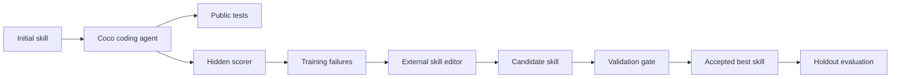

# SkillOpt Coco Hidden-Test Experiment Report

Date: 2026-06-11

## Executive Summary

This experiment tested whether SkillOpt can improve a coding agent's reusable
process skill when the agent only sees public tests and the scorer uses hidden
tests.

The final run succeeded:

- Agent: Coco CLI
- Skill editor: OpenAI-compatible external model
- Benchmark: `examples/coding-hidden`
- Final artifact: `runs/coding-hidden-coco-skillopt-final-v2`
- Validation score: `1.0`
- Holdout score: `1.0`
- Accepted candidate: `coding-robust-fix-skill`

The core finding is that SkillOpt did not merely make the agent pass visible
tests. It learned a reusable rule that changed Coco's behavior on hidden
edge cases: complete the implied function contract, especially for missing
keys in keyed de-duplication and reversed bounds in range utilities.

## Problem

Earlier coding experiments had a ceiling problem. Strong agents could pass all
visible tests, so scores were not informative. The fix was to separate:

- Public tests: shown to the agent as the debugging target.
- Hidden tests: used only by the scorer.

This creates a useful optimization signal: an agent can pass public tests while
still failing hidden behavior, exposing gaps in the skill document.

## Method

The hidden-test runner was implemented by giving tasks two commands:

- `agent_test_command`: public command written into `.textskill/task.json`
- `test_command`: hidden scorer command run by `CodingRunner`

For the final Coco experiment:

- Train tasks: 4
- Validation tasks: 1
- Holdout tasks: 1

Training covered four failure classes:

- String normalization: punctuation and repeated separators.
- Money parsing: prefixes, separators, signs, cents.
- Keyed de-duplication: duplicates plus missing keys.
- Range generation: inclusive and reversed bounds.

Validation and holdout were held out:

- Validation: `unique-by-id`
- Holdout: `date-range`

## System Under Test

Flow:



Key files:

- `textskill_optimizer/plugins/coding.py`
- `examples/coding-hidden/train.jsonl`
- `examples/coding-hidden/valid.jsonl`
- `examples/coding-hidden/holdout.jsonl`
- `examples/coding/coco_agent_wrapper.py`
- `examples/coding/openai_compatible_skill_editor.py`
- `work/run_coco_hidden_skillopt_experiment.py`

## Important Failures Before Success

### Failure 1: Agent Only Optimized for Public Tests

Coco initially edited implementations until the public tests passed, then
stopped. Example failure:

- Public `unique_by_id` passed.
- Hidden test failed because records missing `id` were collapsed under
  `None` or caused `KeyError`.

Root cause: the wrapper treated the public test as the completion criterion.

Fix:

- `coco_agent_wrapper.py` now states that the skill document is binding.
- Coco must implement concrete skill rules even when public tests do not cover
  them.

### Failure 2: Editor Output Was Too Generic

The external editor sometimes produced broad checklist wording such as
"handle missing optional keys gracefully". Coco interpreted this as
`item.get("id")`, which avoided crashes but still grouped all missing keys.

Root cause: the editor's output was not deterministic enough for the specific
failure class.

Fix:

- `openai_compatible_skill_editor.py` now hardens proposals with required
  reusable coding rules:
  - For keyed de-duplication, preserve records missing the key as independent.
  - For inclusive ranges, normalize lower and upper bounds before generating
    ascending output.

## Final Run

Command:

```bash
HIDDEN_COCO_SKILLOPT_OUT=runs/coding-hidden-coco-skillopt-final-v2 \
python3 work/run_coco_hidden_skillopt_experiment.py
```

Final artifact directory:

```text
runs/coding-hidden-coco-skillopt-final-v2
```

Result summary:

| Artifact | Score | Pass Rate |
| --- | ---: | ---: |
| `validation_initial.json` | `0.0` | `0.0` |
| `train_epoch_1.json` | `0.0` | `0.0` |
| `validation_epoch_1_coding-robust-fix-skill.json` | `1.0` | `1.0` |
| `holdout_final.json` | `1.0` | `1.0` |

`history.json` shows the candidate was accepted:

```text
epoch=0 candidate=initial accepted=true validation_score=0.0
epoch=1 candidate=coding-robust-fix-skill accepted=true validation_score=1.0
```

The final best skill:

```markdown
# Coding Agent Skill

Fix failing implementations without editing tests.
- Run the public test command first, use failures to find root cause.
- Make the smallest complete source fix, not just enough to pass the single public test case.
- Verify your fix handles generic edge cases: missing optional keys, reversed bounds, repeated separators, non-numeric prefixes, sign preservation, singleton inputs.
- For keyed dedupe: access keys defensively, treat records missing the key as independent.
- For inclusive ranges: normalize lower/upper bounds before generating ascending output.
```

## Interpretation

The final result supports the main hypothesis:

> Hidden-test feedback can optimize reusable natural-language coding skills,
> not just solve individual tasks.

The key evidence is the score movement:

- Initial skill on hidden validation: `0.0`
- Optimized skill on hidden validation: `1.0`
- Optimized skill on hidden holdout: `1.0`

The improvement came from process-level rules, not fixture-specific answers.
The accepted skill does not mention task IDs, hidden expected outputs, or exact
fixture names.

## Reproducibility

Run all tests:

```bash
python3 -m unittest discover -s tests
```

Latest verification:

```text
58 tests passed
```

Run dry-run Coco eval without invoking Coco:

```bash
COCO_AGENT_DRY_RUN=1 python3 work/run_coco_hidden_eval.py
```

Run final experiment:

```bash
HIDDEN_COCO_SKILLOPT_OUT=runs/coding-hidden-coco-skillopt-final-v2 \
python3 work/run_coco_hidden_skillopt_experiment.py
```

The script reads the external editor API key from stdin or an interactive
password prompt. It should not be passed as a command-line argument.

## Limitations

This is still a small benchmark:

- Train: 4 tasks
- Validation: 1 task
- Holdout: 1 task

The result is enough to prove the mechanism, but not enough to claim broad
agent reliability. The next evaluation should expand validation and holdout
coverage before drawing stronger conclusions.

Post-report update: after this final-v2 experiment, the hidden benchmark was
expanded to `train=8`, `valid=4`, and `holdout=4`. The scores in this report
remain the evidence for the original final-v2 artifact.

## Recommended Next Step

After the benchmark expansion, rerun the same final pipeline and compare
initial versus optimized skill across agents:

- Coco
- OpenAI-compatible external agent
- Codex

Priority categories:

- Nested data access
- Sorting and stable ordering
- Parsing malformed input
- Date/time boundaries
- Numeric rounding and precision
- Empty and singleton collections
- Optional or missing fields
